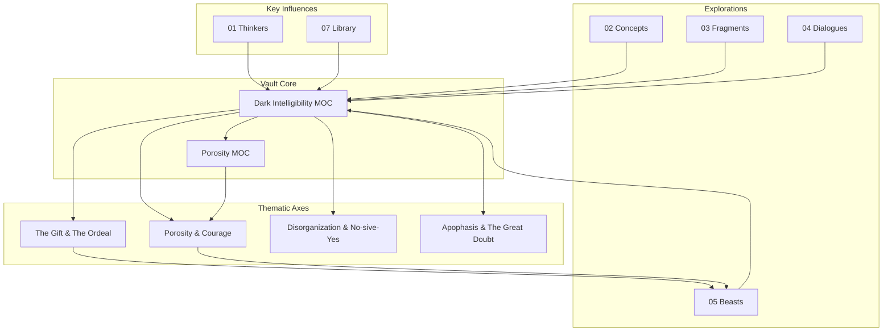

# Obsidian Vault Architecture: Dark Intelligibility

This document provides an overview of the architecture of the "Dark Intelligibility" Obsidian Vault.

## I. Conceptual Core

The vault is a knowledge system designed for philosophical inquiry, centered on the concept of **Dark Intelligibility**. This is supported by a secondary core concept, **Porosity**.

- **Dark Intelligibility**: Explores paradox, the ordeal of being, and the limits of reason. It's the central axis of the vault.
- **Porosity**: Represents a state of openness, receptivity, and vulnerability, acting as an antidote to a closed-off ego.

## II. Architectural Visualization

The following diagram illustrates the relationships between the core components of the vault.

## III. Key Components

1.  **Index (00 Index)**: Contains the main Maps of Content (MOCs) that serve as the central hubs of the vault.
    - `Dark Intelligibility MOC.md`: The primary entry point and guide to the vault's themes.
    - `Porosity MOC.md`: A detailed exploration of the concept of porosity.

2.  **Thinkers (01 Thinkers)**: Notes on key philosophical and literary influences, such as Clarice Lispector, William Desmond, and Keiji Nishitani.

3.  **Concepts (02 Concepts)**: Atomic notes defining and exploring the core concepts of the vault (e.g., `Pharmakon.md`, `Kenosis.md`, `Aporia.md`).

4.  **Fragments (03 Fragments)**: Short, reflective pieces and personal insights.

5.  **Dialogues (04 Dialogues)**: Explorations of the core concepts in conversational form, including dialogues with AI.

6.  **Beasts (05 Beasts)**: Longer, more developed essays or "beasts" that tackle complex themes in depth. This is where the core ideas are synthesized.

7.  **Library (07 Library)**: A structured collection of notes and excerpts from key texts, designed to be in active dialogue with the rest of the vault.

## IV. Information Flow & Philosophy

The vault is not a static archive but a dynamic system for thinking. The workflow encourages a dialogical approach:

- **Capture**: Ideas are captured in fragments, dialogues, or notes on thinkers.
- **Connect**: Notes are linked to the core concepts and thematic axes.
- **Synthesize**: The "beasts" and MOCs synthesize these ideas into a coherent whole.
- **Engage**: The library is a source of active dialogue, not just a repository of information.

This architecture facilitates a process of continuous discovery, where the act of writing and linking is a form of thinking in itself.
## V. Proposed Improvements to Writing Structure & Strategy

The existing "Garden Writing Strategy" is excellent. The following proposals are designed to complement and enhance it, focusing on structural changes that can support the existing workflow.

### 1. Elevate Thematic Axes into "Incubation MOCs"

The thematic axes in the main MOC (e.g., "The Gift & The Ordeal") are powerful lenses. They could be elevated from simple headings into their own lightweight MOCs.

- **Action**: Create a new MOC for each major thematic axis (e.g., `The Gift & The Ordeal MOC.md`).
- **Benefit**: This turns each theme into an "incubation space" where related fragments, dialogues, and library notes can be gathered before they are mature enough to be integrated into a "Beast." This supports the "Growing Season" tier of your garden strategy.

### 2. Create a "Question Trail" MOC

The `15 Question Trails` directory is a great idea, but it could be centralized into a single MOC to make it more actionable.

- **Action**: Create a `Question Trail MOC.md` that lists all the major open questions in the vault. Each question would link to the relevant notes and fragments.
- **Benefit**: This provides a clear overview of the intellectual "growing edges" of the vault and can help guide your writing sessions. It also provides a clear entry point for the "Daily Plot" tier of your garden strategy.

### 3. Formalize the "Beast" Lifecycle: Feeding and Harvesting

The concept of "Beasts" is central to the vault's purpose. As you've pointed out, this relationship should be reciprocal: "Beasts" are not just fed, they also feed back into the vault. This lifecycle could be made more explicit.

- **Action**: Create a `Beast Lifecycle` note that outlines the stages of a beast's development:
    1.  **Conception**: A question or theme emerges.
    2.  **Incubation**: The idea is nurtured in a thematic MOC.
    3.  **Gestation**: A dedicated "Beast" note is created and actively "fed."
    4.  **Harvesting**: Key insights, concepts, and questions are extracted from the "Beast" and planted back into the vault as new, atomic notes (see "Seed Notes" below).
    5.  **Fallow**: The "Beast" is considered "complete" (for now) and is linked back to the main MOC, while the harvested seeds are cultivated elsewhere.
- **Benefit**: This provides a clear and repeatable process for developing your most important ideas, moving them from seed to mature plant, and then using those mature plants to seed new growth in the vault.

### 4. Introduce "Seed Notes" for Cultivation

To support the "Harvesting" stage of the "Beast" lifecycle, you could introduce a new type of note: the "Seed Note."

- **Action**: Create a template for "Seed Notes" that includes:
    - A single, atomic idea.
    - A link back to the "Beast" from which it was harvested.
    - A set of questions or prompts for future cultivation.
- **Benefit**: This formalizes the process of feeding the vault from your "Beasts" and provides a clear pathway for turning mature ideas into new avenues of inquiry.

### 4. Implement a "Resonance" Tagging System

While the vault's linking is excellent, a lightweight tagging system could help to surface unexpected connections.

- **Action**: Introduce a simple set of "resonance tags" (e.g., `#resonance/lispector`, `#resonance/desmond`, `#resonance/bourdain`). These would be used to mark passages in your notes that resonate with a particular thinker, even if they are not directly about them.
- **Benefit**: This allows for a more fluid and serendipitous discovery of connections between ideas, supporting the "Porosity Principle" of your garden strategy.

### 5. Create a "Dialogue" Index

The `04 Dialogues` directory is a unique and valuable part of the vault. A dedicated index would make it more accessible.

- **Action**: Create a `Dialogues Index.md` that lists all the dialogues, along with a brief summary of the key themes and participants.
- **Benefit**: This provides a clear overview of the conversational threads in the vault and makes it easier to see how different ideas have been explored in dialogue with each other.