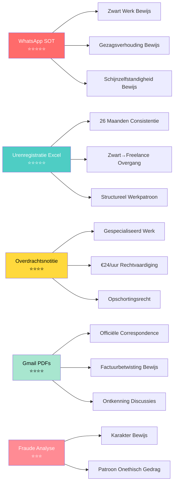
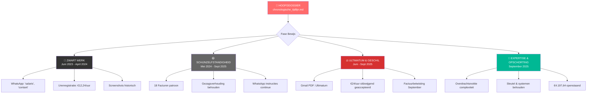

# JURIDISCH DOSSIER PROJECTSTRUCTUUR
## Jeroen Kortekaas vs. Vendulion/Jurriën Kuijper

---

## **VISUEEL OVERZICHT BEWIJSSTRUCTUUR**

```mermaid
graph TB
    A[📁 WORKDOCS - Hoofddossier] --> B[📄 chronologische_tijdlijn.md<br/>HOOFDDOCUMENT]

    A --> C[📁 Emails en Chatgeschiedenis]
    C --> C1[📄 WhatsApp Chat with Jurriën.txt<br/>🔴 SOT - 26 maanden communicatie]
    C --> C2[📄 Werknemerrelatie_WhatsApp.md<br/>📊 Juridische analyse]
    C --> C3[📄 Gmail - Reactie op voorstel.pdf<br/>💌 Ultimatum correspondence]
    C --> C4[📄 Gmail - Factuur 2025-017.pdf<br/>⚖️ Betwisting bewijs]
    C --> C5[📄 Gmail - Herinnering Factuur 2025-017.pdf<br/>📮 Follow-up correspondence]

    A --> D[📁 Facturen]
    D --> D1[📄 2024-004 t/m 2024-009<br/>📋 Vroege freelance periode]
    D --> D2[📄 2024-5-001, 2024-5-002<br/>🔄 Overgang zwart → freelance]
    D --> D3[📄 2024-7-003<br/>📅 Juli 2024]
    D --> D4[📄 2025-010 t/m 2025-015<br/>📈 2025 Periode]
    D --> D5[📄 2025-016, 2025-017, 2025-018<br/>🔥 GESCHIL FACTUREN]

    A --> E[📁 HOOFDBEWIJZEN]
    E --> E1[📄 Payroll_contract.pdf<br/>💼 Onredelijk voorstel]
    E --> E2[📄 voorbereiding_mei.md<br/>📝 Professionalisering poging]
    E --> E3[📄 Vendulion Urenregistratie.xlsx<br/>⏰ COMPLETE 26-maand registratie]
    E --> E4[📄 Overdrachtsnotitie.md<br/>🤖 AI/Software expertise bewijs]

    A --> F[📁 HISTORISCH BEWIJS]
    F --> F1[📄 UrenspecificatieNovember2023.jpg<br/>💰 Zwart tarief €12,24]
    F --> F2[📄 UrenspecificatieApril2024.jpg<br/>🔄 Overgang freelance €16,53]
    F --> F3[📄 Verbinding_134_InboedelsBV.jpg<br/>🔍 Fraudeonderzoek beelden]

    A --> G[📁 FRAUDE ANALYSE]
    G --> G1[📄 API_Analyse_Vendulion_Veilingpraktijken.md<br/>🚨 Shill bidding & belastingfraude]

    A --> H[📁 archief]
    H --> H1[📄 Obsolete analyses<br/>📦 Vervangen documenten]
    H --> H2[📄 Development files<br/>🔧 Oude versies]
    H --> H3[📄 17-9-2025_Reactie_Herinnering.md<br/>📧 Superseded correspondence]

    style B fill:#ff6b6b,stroke:#333,stroke-width:4px,color:#fff
    style C1 fill:#4ecdc4,stroke:#333,stroke-width:3px,color:#fff
    style D5 fill:#ffe66d,stroke:#333,stroke-width:3px,color:#000
    style E3 fill:#a8e6cf,stroke:#333,stroke-width:3px,color:#000
    style E4 fill:#ffd93d,stroke:#333,stroke-width:3px,color:#000
    style G1 fill:#ff8b94,stroke:#333,stroke-width:3px,color:#fff
```

---

## **BESTANDSOVERZICHT PER CATEGORIE**

### 🔴 **KRITIEKE DOCUMENTEN**
| Bestand                          | Functie                                         | Status         |
| -------------------------------- | ----------------------------------------------- | -------------- |
| `chronologische_tijdlijn.md`     | **HOOFDDOSSIER** - Complete juridische timeline | ✅ **ACTUEEL**  |
| `WhatsApp Chat with Jurriën.txt` | **SOT** - Originele communicatie bewijs         | ✅ **PRIMAIR**  |
| `Vendulion Urenregistratie.xlsx` | **COMPLETE** urenregistratie (26 maanden)       | ✅ **CRUCIAAL** |

### 📊 **ANALYSE DOCUMENTEN**
| Bestand | Functie | Verwijst naar |
|---------|---------|---------------|
| `Werknemerrelatie_WhatsApp.md` | Juridische analyse chat | → WhatsApp SOT |
| `API_Analyse_Vendulion_Veilingpraktijken.md` | Fraudeonderzoek | → Screenshots |
| `voorbereiding_mei.md` | Professionalisering strategie | → Chat bewijs |

### 💼 **CONTRACTUELE BEWIJZEN**
| Bestand | Periode | Relevantie |
|---------|---------|-----------|
| `Payroll_contract.pdf` | Juni 2025 | Onredelijk voorstel |
| `Gmail - Reactie op voorstel.pdf` | Juni 2025 | Ultimatum & reactie |
| `Gmail - Factuur 2025-017.pdf` | Sept 2025 | Factuurbetwisting |

### 🔥 **GESCHIL KERN**
| Bestand | Bedrag | Status |
|---------|--------|--------|
| `2025-016_Vendulion_JeroenKortekaas.pdf` | €2.810,98 | 🔴 **BETWIST** |
| `2025-017_Vendulion_JeroenKortekaas.pdf` | €1.386,66 | 🔴 **BETWIST** |
| `2025-018_Vendulion_JeroenKortekaas.pdf` | €- | 🔴 **BETWIST** |
| **TOTAAL OPENSTAAND** | **€4.197,64** | **🚨 GESCHIL** |

### 🤖 **EXPERTISE BEWIJS**
| Bestand | Toont aan |
|---------|-----------|
| `Overdrachtsnotitie.md` | **AI-automatisering, Python scripting, systeemcomplexiteit** |
| → Rechtvaardigt €24/uur tarief | → Essentiële bedrijfsfunctie |
| → Intellectueel eigendom | → Opschortingsrecht legitimiteit |

---

## **JURIDISCHE KRACHT PER DOCUMENT**

---

## **DOCUMENT STATUS & TOEGANKELIJKHEID**

### ✅ **VOLLEDIG & ACTUEEL**
- 📄 `chronologische_tijdlijn.md` - **HOOFDDOSSIER**
- 📄 `WhatsApp Chat with Jurriën.txt` - **SOT BEWIJS**
- 📄 `Vendulion Urenregistratie.xlsx` - **26 MAANDEN DATA**
- 📄 `Overdrachtsnotitie.md` - **EXPERTISE BEWIJS**
- 📁 `Facturen/` - **18 FACTUREN COMPLEET**

### 📦 **GEARCHIVEERD**
- 📁 `archief/` - Obsolete analyses en ontwikkelingsbestanden
- Oude markdown analyses (vervangen door geconsolideerde versie)
- Superseded correspondence

### 🔒 **OPSCHORTINGSRECHT**
- 🗝️ **Bedrijfssleutel** - Teruggehouden sinds 9 sept 2025
- 📋 **Overdrachtsnotitie** - Essentiële systemen & AI-scripts
- 🔐 **Toegangscodes** - Alle systemen gedocumenteerd

---

## **JURIDISCHE STRATEGIE FLOW**

---

## **GEBRUIK VAN DIT DOSSIER**

### 📋 **VOOR JURIDISCHE PRESENTATIE**
1. **Start met:** `chronologische_tijdlijn.md` (hoofdverhaal)
2. **Ondersteun met:** WhatsApp SOT + Gmail PDFs
3. **Kwantificeer met:** `Vendulion Urenregistratie.xlsx`
4. **Legitimeer tarief met:** `Overdrachtsnotitie.md`

### 🔍 **VOOR ONDERZOEK**
- **Alle citaten traceerbaar** naar originele bronnen
- **Chronologische volgorde** van 26 maanden
- **Complete paper trail** van zwart → freelance → geschil

### ⚖️ **VOOR RECHTSZAAK**
- **Primaire bronnen:** WhatsApp, Gmail PDFs
- **Ondersteunend:** Excel registraties, analyses
- **Context:** Fraude-onderzoek, expertise bewijs