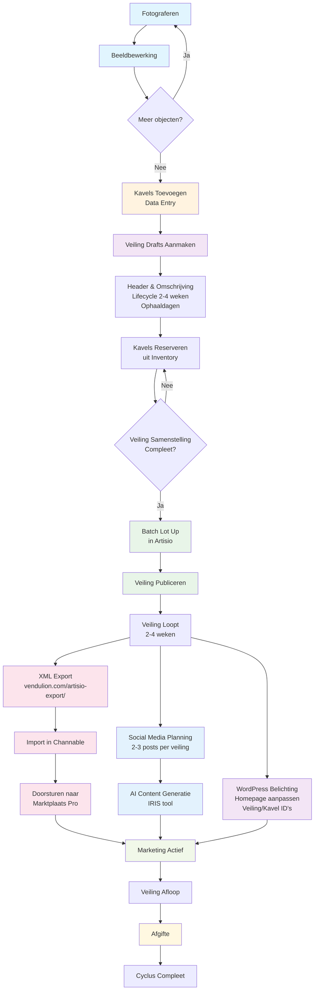

# Overdrachtsnotitie

## Inhoudsopgave
1. [Overzicht Veilingcyclus](#overzicht-veilingcyclus)
2. [Toegang & Systemen](#10-toegang--systemen)
3. [Workflow Kavelverwerking](#20-workflow-kavelverwerking-van-binnenkomst-tot-online)
4. [Marketing & Promotie](#30-marketing--promotie)
   - [Nieuwsbrief Automation](#31-mailchimp-nieuwsbrief)
   - [Channable & Marktplaats](#32-channable-en-marktplaats-pro-strategie--beheer)
   - [Social Media Strategy](#33-social-media)
5. [WordPress Beheer](#35-wordpress-beheer)
6. [AI & Automatisering](#40-ai--automatisering)
   - [Python Setup](#401-python-omgeving-setup)
   - [Configuratie & Troubleshooting](#41-configuratie-en-onderhoud)

---

## Overzicht Veilingcyclus



### Terugkerende Veilingen
- **Vintage, Design en Moderne Meubels**
- **Klassieke en Antieke Meubels**
- **Curiosa**
- **Antiek en Decoratie**
- **Kunst**

---

## 1.0 Toegang & Systemen

Wachtwoorden zie `Brave_Passwords.csv`

### 1.1 Artisio (AMS)
- Veilingmanagement Systeem

### 1.2 Channable (Bulk Advertenties)
- Bulk advertenties aanmaken in Marktplaats of andere kanalen

### 1.3 Overige Systemen
- **Marktplaats Pro**: Advertenties beheren
- **Mailchimp**: E-mail marketing
- **1stdibs**: 3rd party internationale verkoop

## 2.0 Workflow Kavelverwerking (Van Binnenkomst tot Online)

### 2.1 Fotografie

Fotografie van de kavels is verdeeld in twee studio's. We schieten handmatig en gebruiken verschillende handmatige witbalans-settings voor meubels en kleinere objecten.

**Camera instellingen:**
- **Meubelstudio**: Sluitertijd `1/80`, `500 ISO`, diafragma `F4.0`
- **Fotostudio**: `ISO 100`
- **Bestandsformaat**: `.raw` voor uitgebreidere bewerking en cropping

**Fotografietips:**
- Curve in display goed positioneren om over- of onderbelichting te voorkomen
- Alle kanten van het object fotograferen om verrassingen voor kopers te voorkomen, merkstikkers fotograferen
- Realistische weergave van exterieur, interieur en eventuele schade

**Magazijnindeling:

- Alle meubels een sticker geven met oplopend magazijnnummer
- Ongefotografeerd en gefotografeerd gescheiden houden
- Meubels organiseren op soort voor gemakkelijk opzoeken

### 2.2 Beeldbewerking

**Bewerken in Photoshop Camera RAW:**
- Altijd `Optics > Use profile corrections` aanvinken voor lens correctie
- Afsnijden (Crop) aanpassen, 1:1 voor Thumbnails/Primaire foto
- Belichting verfijnen
- `Remove (B)` gebruiken om storende objecten of vlekken te verwijderen
- `Mask (M)` en `Dehaze` gebruiken voor neutrale witte achtergrond (let op: kan schaduwen doen verdwijnen)

**Exporteren in Photoshop Camera RAW:**
- Meubels en objecten naar aparte folderstructuur exporteren
- Via `Convert en save to image` exporteren naar JPG, hoge kwaliteit `maximum: 10-12`
- Circa 63% afmetingen verkleinen voor bestandslimieten in Artisio
- Op `Done` klikken om raw settings op te slaan, `Cancel` om niet op te slaan

### 2.3 Kavelbeschrijving & Data Entry

**Excel Template Verwerking:**
Kavelgegevens worden verwerkt in Excel op basis van het Artisio template.
Download template via: `Stock > Inventory > Actions > Download Template`

**Belangrijkste columns:**
`Receipt | Klantnummer | Afdeling | Categorie | Aantal | Titel | Omschrijving`

**Titel opstellen:**
Een passende titel kan worden vastgesteld aan de hand van:
- Merk, stijl en periode
- Materiaal
- Herkomst
- **Let op**: Bij twijfel geen aannames maken

**Beschrijving:**
- Achtergrond informatie over de kavel
- Conditie van de kavel vastleggen
- Afmetingen vaststellen

Ook handig:
- Inventorynummer in apart column overeenkomend met sticker op kavel

### 2.4 Inventory aanmaken in Artisio

**Excel Upload:**
Het Excel bestand kan ge-upload worden via: `Stock > Inventory > Actions > Upload Items`

**Foto's Toevoegen:**
Afbeeldingen handmatig via Bridge of Finder slepen in `Artisio > Stock > Inventory`. Dit kan direct in de overzichtslijst zonder individuele kavel bewerking. Dit zorgt ook dat de foto's in de juiste volgorde komen.

### 2.5 Veilingen Aanmaken in Artisio

`Sales > New Sale `

Titels: Vintage, Design en Moderne Meubels, Klassieke en Antieke Meubels, Curiosa, Antiek en Decoratie, Kunst, etcetera. 
Department: Afdeling
Omschrijving: `<b>Ophaaldagen:</b> 5-15 november van 10:00-16:00`
Session: standaard `Main Session`
Start/End: Looptijden
Images: De eerste in de reeks is de thumbnail, tweede in de reeks is de header

Kavels kunnen gereserveerd worden voor een veiling via verschillende manieren. 
- Uit `Inventory` items selecteren en `Assign Sale` klikken en salenummer / titel invoeren
- Uit voltooide sales kavels met status `Unsold` aan een nieuwe veiling toewijzen
- Bij het bewerken van de items zelf kan je de reserveringen aanpassen

Met `Batch Lot Up` verkavelen we de inventory en wijs je lotnummers toe aan de kavels. Ook kan een curatie gemaakt worden van de volgorde van categoriëen en kavels zelf. 

## 3.0 Marketing & Promotie

### 3.1 Mailchimp Nieuwsbrief

Tijdens de veilingcyclus kunnen we ook nieuwe subscribers toevoegen aan Mailchimp. In Artisio kan je recente nieuwe klanten exporteren en toevoegen aan Mailchimp. 

Nieuwsbrieven kunnen handmatig gemaakt worden of via Create E-mail:

**Wanneer gebruiken:**
Deel van de veilingcyclus voor het versturen van de nieuwsbrief met actuele veilingen en highlight kavels. Vervangt de handmatige vormgeving wat foutgevoelig en herhalend is.

**Hoe werkt het:**
Het systeem haalt automatisch de nieuwste veilingsgegevens op uit Artisio en maakt er een professionele nieuwsbrief van. In plaats van handmatig alle kavelfoto's,  beschrijvingen en links te kopiëren, gebeurt dit allemaal automatisch.

**Proces:**
1. **Script uitvoeren**: `python create_email.py` in de terminal (zie [Python Setup](#401-python-omgeving-setup))
2. **Editorial controle**: Pas `editorial.json` aan om te bepalen:
   - Welke kavels belicht worden (highlight_lots)
   - Volgorde van veilingen (highlight_first)
   - Welke veilingen uitgesloten worden (exclude)
3. **Resultaat**: Automatisch Mailchimp concept aangemaakt, klaar om te reviewen en versturen
4. **Review**: Controleer het concept in Mailchimp dashboard voordat je verzend. Het is belangrijk dat de mail alleen naar subscribers gaan die op opt-in staan.

**Belangrijke bestanden:**
- `editorial.json`: Hier stel je in welke kavels en veilingen je wilt benadrukken
- `.env`: Bevat de wachtwoorden en configuratie

### 3.2 Channable en Marktplaats Pro (Strategie & Beheer)

**XML Feed Automatisering:**
Zodra nieuwe veilingen live gaan, worden automatisch advertenties op Marktplaats geplaatst via Channable. Dit proces heeft de oude handmatige export volledig vervangen - er is geen backup workflow beschikbaar.

**Hoe het werkt:**
Het systeem downloadt alle kavelgegevens van een veiling via de Artisio API en genereert een XML feed die Channable kan importeren. Channable zorgt vervolgens voor automatische advertentie-plaatsing op Marktplaats.

**XML Feed Generatie:**
1. **Beschikbare veilingen bekijken**: `python publish_xml.py --list-auctions` (zie [Python Setup](#401-python-omgeving-setup))
2. **Enkele veiling verwerken**: `python publish_xml.py --group 1` (waar 1 het veiling ID is)
3. **Meerdere veilingen combineren**: `python publish_xml.py --group 1 2` (combineert veiling 1 en 2)
4. **Feed URL verkrijgen**: Script genereert publieke URL voor de XML feed
5. **In Channable configureren**: 
   - Voeg de feed URL toe in Channable dashboard
   - Stel mapping in voor Marktplaats formaat
   - Activeer automatische synchronisatie

**Feed Management:**
- **Losse veilingen**: Elke veiling apart verwerken voor specifieke targeting
- **Thematische bundeling**: Gerelateerde veilingen combineren (bijv. alle meubelveilingen)
- **Update frequentie**: Feeds worden automatisch bijgewerkt bij wijzigingen in Artisio

**Importeren in Channable en exporteren naar Marktplaats**

In Channable staan twee projecten `Meubels` en `Objecten en andere veilingen` met elk verschillende categorie filters die verfijnen welke categorieën de advertenties in Marktplaats komen te staan.

`Setup > Combineer Imports > XML` 

Vul naam in e.g. `Design en Antieke Meubels` en URL naar XML bestand. 

In de mapping zorgen dat de verschillende velden juist gekoppeld zijn 

`Afbeelding --> image_link`

In `Items` zie je een overzicht van de geïmporteerde kavels, met thumbnails als de foto's juist gekoppeld zijn.

In `Kanalen > Marktplaats Pro` bereiden we de advertenties voor voor Marktplaats.

In `Instellingen` kan je de API activeren/deactiveren en instellen of de advertenties live of gepauzeerd verstuurd worden.

In `Categorieën` stel je de categorieën in en kan je aanpassingen maken op basis van kernwoorden, categorie of andere velden. Zo zorg je dat de kavels doelgericht en zo breed mogelijk bereik krijgen. Dit is de belangrijkste stap.

In `Regels` kan je handmatig filters aanmaken of andere regels. Eén truc als Channable de bestaande advertenties onder hetzelfde 'id' ziet, is om de 'id' van de campagne te wijzigen e.g. -1 of -2. Als advertenties niet doorgestuurd worden is het 'id' vaak de oorzaak.

In `Opbouw` kan je globaal de opbouw van de advertentie in Marktplaats aanpassen voor elke advertentie. Ook biedstrategie en budget pas je hier aan.

In Marktplaats kan je de gepauzeerd verzonden advertenties, activeren, pauzeren en verwijderen. Ook kan je daar het budget aanpassen van advertenties en het totaalbudget.

### 3.3 Social Media

**Content Strategie:**
Omschrijvend maar geëngagerende content die feitelijke informatie combineert met achtergrondinformatie die kopers aanspreekt. Geen overdreven marketing taal, maar wel interessante details over vakmanschap, geschiedenis en gebruik.

**Posting Frequentie:**
2-3 posts per veilingcyclus om specifieke highlight kavels onder de aandacht te brengen op Instagram/Facebook.

**AI Content Generatie met IRIS:**

**Wanneer gebruiken:**
Voor het dieper onderzoeken van kavels en creëren van voorbeeld social teksten. 

**Dagelijks proces:**
1. **Kavel UUID opzoeken**: In Vendulion.com, kopieer de UUID van het kavel dat je wilt promoten
2. **Content genereren**: `python iris.py --lot [UUID]` (zie [Python Setup](#401-python-omgeving-setup)) 
3. **Review output**: Bekijk de gegenereerde post in de `posts/` map
4. **Aanpassen indien nodig**: Pas tekst aan voor je eigen stijl
5. **Publiceren**: Kopieer de tekst en hashtags naar Instagram/Facebook

**Content Richtlijnen:**
- Feitelijke, informatieve posts zonder superlatieven
- Historische context en vakmanschap details
- Praktische informatie over gebruik en onderhoud
- Passende hashtags gebaseerd op stijl en materiaal
- Realistische weergave van conditie en waarde

## 3.5 WordPress Beheer

**Admin Toegang:**
- URL: https://vendulion.com/wp-admin
- Wachtwoorden zie `Brave_Passwords.csv`

### Homepage Belichting Aanpassen

**Navigatie:**
`Pagina's > Alle Pagina's > Home`

**Belichting Configureren:**
In de homepage editor kunnen veilings- en kavel belichtingen worden aangepast door de corresponderende ID's in te voeren.

**ID Formaat:**
- **Veiling ID/Kavel ID**: `bb14ac83-af03-453e-af33-b8286d06856a`

**Workflow:**
1. Inloggen op WordPress admin
2. Navigeren naar `Pagina's > Alle Pagina's > Home`
3. Pagina bewerken
4. Belichting sectie zoeken
5. Veiling/Kavel ID's invoeren of aanpassen
6. Wijzigingen opslaan en publiceren
7. Live website controleren

**Timing:**
- Belichtingen bijwerken zodra nieuwe veilingen live gaan
- Regelmatig controleren of belichte kavels nog beschikbaar zijn
- Na afloop van veilingen belichtingen vervangen

## 4.0 AI & Automatisering

Deze sectie beschrijft de geautomatiseerde processen die dagelijks gebruikt worden om de marketing workflows efficiënter te maken.

### 4.0.1 Python Omgeving Setup

Gebruik Terminal of Visual Studio Code

**Algemene Python Instructies:**
Voor alle Python scripts in dit document:

1. **Virtual Environment Activeren:**
   ```bash
   # Navigeer naar de project directory
   cd /path/to/project
   
   # Activeer de virtual environment (indien aanwezig)
   source venv/bin/activate  # macOS/Linux
   # of
   venv\Scripts\activate     # Windows
   ```

2. **Dependencies Installeren:**
   ```bash
   # Als requirements.txt bestaat:
   pip install -r requirements.txt
   
   # Anders, installeer handmatig benodigde packages:
   pip install mailchimp-marketing boto3 python-dotenv
   ```

3. **Environment Variabelen:**
   Controleer dat `.env` bestanden bestaan en correct ingevuld zijn:
   - API keys (Mailchimp, Claude AI, AWS)
   - Database credentials  
   - Service endpoints

4. **Script Uitvoeren:**
   ```bash
   python script_name.py [arguments]
   ```

**Troubleshooting:**
- Script werkt niet: Controleer of `.env` correct is ingevuld
- Import errors: Installeer ontbrekende packages met `pip install [package-name]`
- Permissie errors: Virtual environment opnieuw activeren

### 4.1 Configuratie en Onderhoud

**Environment Bestanden:**
Alle API keys en wachtwoorden staan in `.env` bestanden in elk project. Deze zijn niet opgeslagen in version control om veiligheidsredenen.

**Belangrijke configuratie bestanden:**
- `editorial.json`: Editorial controle voor nieuwsbrieven (highlight kavels, volgorde, exclusies)
- `.env`: API keys en service credentials
- `requirements.txt` of handmatige package installatie (zie sectie 4.0.1)

**Bij problemen:**
- **Script werkt niet**: Controleer of alle `.env` bestanden correct zijn ingevuld
- **Mailchimp automation fails**: Verifieer API keys en account toegang in `.env`
- **XML upload errors**: Controleer AWS S3 configuratie en credentials
- **Import errors**: Installeer ontbrekende packages met `pip install [package-name]`

**Belangrijke accounts:**
- **Mailchimp**: Voor nieuwsbrief automation (zie sectie 3.1)
- **AWS S3**: Voor hosting van XML feeds (zie sectie 3.2)  
- **Claude AI**: Voor content generatie (zie sectie 3.3)

